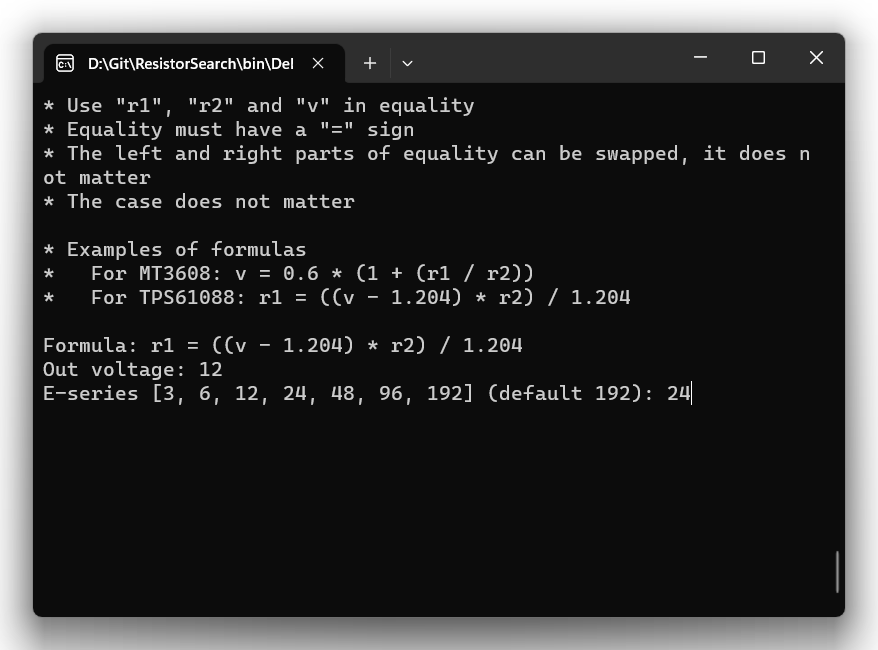
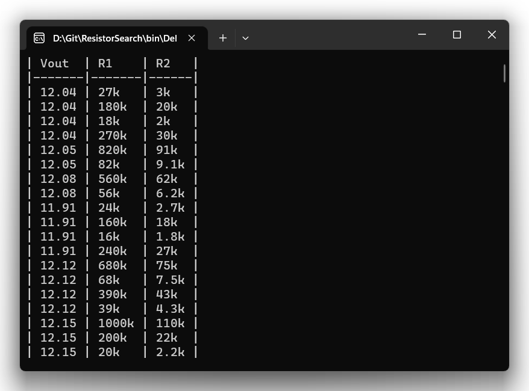

# ResistorSearch

A simple console application that allows you to find a voltage divider for DCDC and LDO using the formula

The application uses parallel tasks that allows you to complete the search for variants of the E192 series in a few seconds

You just need to directly enter the formula from the datasheet and it will work!

Replace "Vout" with "v" and for resistors use the designations "r1" and "r2"

Remember that the application operates only with the variables "r1", "r2" and "v" in the formula, for this reason you should replace values such as "Vref" with a number directly

Also, always use equality in the formula!

